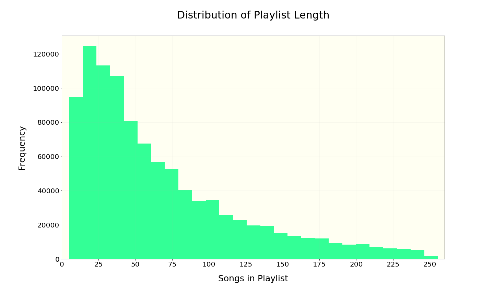

# Table of Contents
[Project Statement and Goals](https://john-daciuk.github.io/spotify/project-statement-and-goals.html) <br>
[Motivation and Background](https://john-daciuk.github.io/spotify/motivation-and-background.html) <br>
[Data Description](https://john-daciuk.github.io/spotify/data-description.html) <br>
[EDA](https://john-daciuk.github.io/spotify/eda.html) <br>
[Data Cleaning](https://john-daciuk.github.io/spotify/data-cleaning.html) <br>
[Metrics](https://john-daciuk.github.io/spotify/metrics.html) <br>
[Data Cleaning](https://john-daciuk.github.io/spotify/data-cleaning.html) <br>
[Model Training](https://john-daciuk.github.io/spotify/model-training.html) <br>
[Interpreting the Model](https://john-daciuk.github.io/spotify/interpreting-the-model.html) <br>
[Model Testing and Results](https://john-daciuk.github.io/spotify/model-testing-and-results.html) <br>
[Literature Review](https://john-daciuk.github.io/spotify/literature-review.html) <br>

# Million Playlist Dataset:
This dataset contains 5.4 GB of data and was created in 2018. It contains the following information for each playlist and track within:

**Playlist specific features:**
- Playlist name
- Indicator if the playlist is a collaboration
- Date when it was last modified
- Number of albums the songs are from
- Number of songs in the playlist
- Number of followers the playlist has
- Number of edits
- Playlist duration
- Number of artists

**Song specific features:**
- Artist
- Track Uri
- Artist Uri
- Track Name
- Album Uri
- Duration
- Album Name

To get an idea of some broad features of the dataset, we plot some distributions:

# Histogram of playlist length

```
from length_hist import length
#length is a dictionary that holds the playlist length distributions

histogram_data = []
for key in length:
    histogram_data += [key] * length[key]

fig, ax = plt.subplots(1,1, figsize = (20,12))
ax.hist(histogram_data, bins = 40, color = 'springgreen', alpha = .8)


ax.set_xlabel("Songs in Playlist", fontsize = 25, labelpad = 20)
ax.set_ylabel("Frequency", fontsize = 25, labelpad = 20)
ax.set_title("Distribution of Playlist Length", fontsize = 30, pad = 50)
ax.set_xlim(0,260)
ax.set_xticks(np.round(np.linspace(0, 250, 11)))
```

